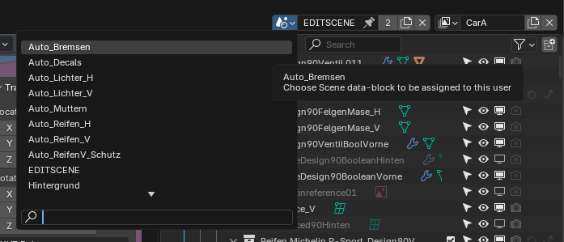

# Blender to Script
Blender exposes File Settings to the script. The interfaces used here are:

## Geometry Nodes
Objects are stored in Geo nodes. Geo nodes can be used to change the blender mesh.

*Example Backlights*
`'bpy.data.objects["Car_LightsBack"].modifiers["GeometryNodes"]["Socket_6"]'` # This is a datapath that accesses the geometry. 

Generating a datapath:

- enter blender 
- right click the geo node
- click `copy full data path`

Modifying the datapath value:

- `path = 'bpy.data.objects["Car_LightsBack"].modifiers["GeometryNodes"]["Socket_6"]'`
- `key = '1'` # String value that the geo node can take
- `path = key`
If anything is wrong within blender silently fails. This means the program still runs but doesn't change any blender values. When rendering this is particularly annoying as you only see if it worked after a few images rendered.

## Materials
Materials are stored in Material nodes. Material nodes can be used to change an objects color and shading.

*Example Main Lack Color*
`'bpy.data.node_groups["COLORGOD"].nodes["LACKFARBE"].outputs[0].default_value'` # This is a datapath that accesses a material node.

Generating a datapath:

- enter blender 
- right click the material node
- click `copy full data path`

Modifying the datapath value:

- `path = 'bpy.data.node_groups["COLORGOD"].nodes["LACKFARBE"].outputs[0].default_value'`
- `key = (r, g, b, alpha)` # rgb value that the material node can take
- `path = key`
If anything is wrong within blender silently fails. This means the program still runs but doesn't change any blender values. When rendering this is particularly annoying as you only see if it worked after a few images rendered.

## Layers
The blender files contain different layers. Each layer is a different setup for for example Full Car Rendering, Brake Rendering, Backlight Rendering...

When one of these specific layers is used blender has to switch to the layer by running:
`bpy.context.window.scene = bpy.data.scenes[scene_name]`
