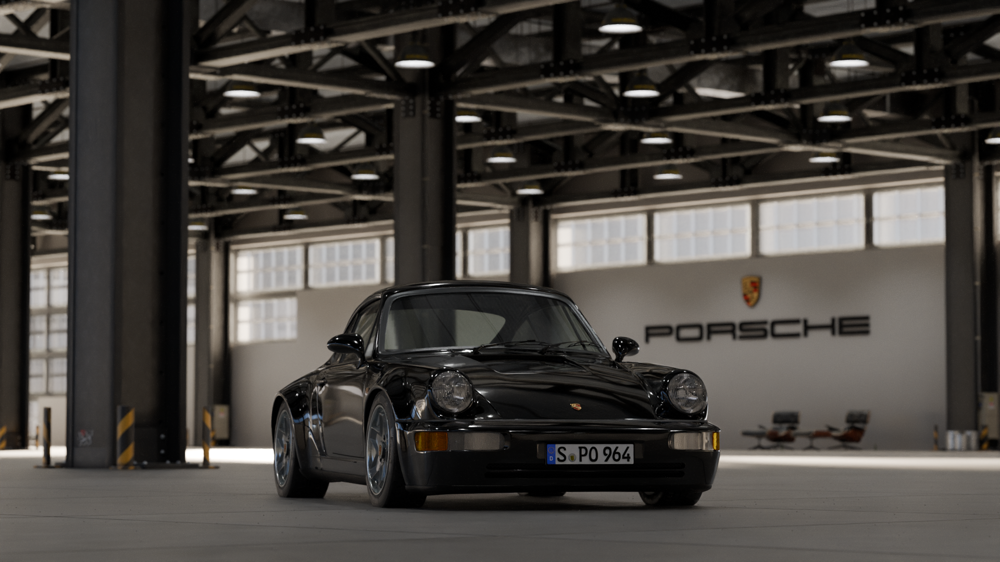
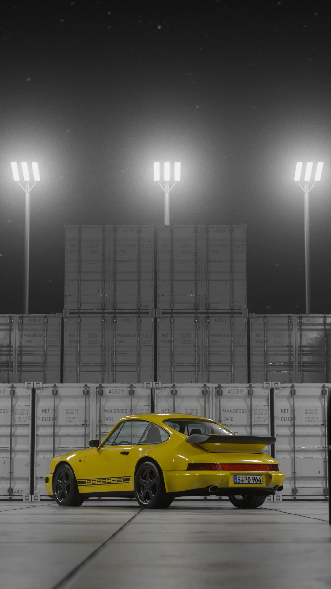
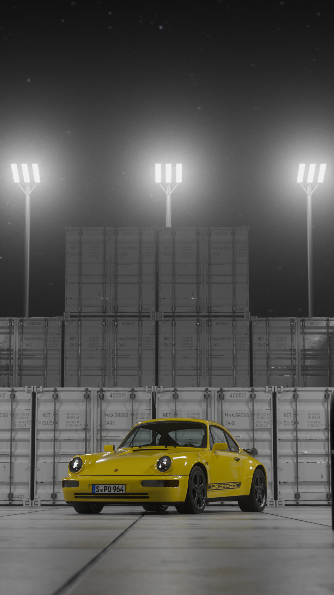
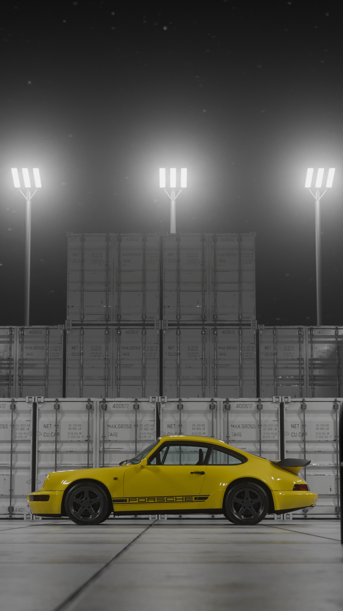

This is only a discussion of how environments (blender geometry environment other than an hdri image) could be implemented

### Requirements
- Background should contain detailed 3D scene
- Background should be interchangeable
- Sweet Spot Cameras only
- Personalised Car should be inside the Environment
- Lighting should be realistic

## Implementation

### Considerations
Main Problem is that the environments are not 360° and the pictures should be taken from different sweet spot angles. 
- Cant be added to existing background Layers because existing cameras would show pictures where the environment ends
- needs different Cameras
- view with existing cameras cant be used?


## Questions:
What render views do we need?
### Only one Beauty-shot
- Simple to implement
- only one view of the car


### Use existing Setup but rotate car
- hard to implement
- more script workload
- all current Cameras would be useable
- needs readjustment for **each** future Environment
- rotates to match environment

	- should use camera rotation
	- car rotates on turntable
	- car shouldn't clip into the ground
### Multiple Beauty-shots
- hard to implement
- more Blender Workload
- Each Environment has a Camera-Setups that render different angles and details
- will cause lots of redundant data -> future error source
- Images will differ from original studio

### Blender File
- Link environemts into 964_ext.blend file
- Geometry node switch for different environments 
- Compositor for Environment on new Scene layer 
- 5 Cameras for different sweet spot photos
- setup car rotation based on different sweet spot cameras 
	- `[Cam1: 0°, Cam2: 45°...]`
### Python Script
- Code create new CFS for environment Geometry node switch
- Create render environment sister function (called out of main render function)
- For each part configuration renders for usual background and then for environment
	- Environment has fewer Cameras
	- Car rotates based on Camera to always show sweet spot environment

Mocked Code
```Python
# Environment Script part
def EnvironmentBG():

configurations = [ # Parts that all influence the Layer (Background in this case)
CFS["Bodykits"],
CFS["FelgenFull"],
CFS["Distanzscheiben"],
CFS["Distanzscheiben"],
CFS["BGColorComp"],
]


slot_mapping = { # Path name fill ins
"bodykit": 0, # Bodykits
...
}


render_scene_with_config( # usual Render
"Hintergrund",
cameras["CamsBG"],
"Hintergrund",
configurations,
slot_mapping,
...
)

# Switch 
# Environments on 
# Backgrounds  off

render_scene_with_environment( # render for environment
"Environment",
cameras["CamsEnv"], #has camera car rotation switch
"Environment",
configurations,
slot_mapping,
...
)
```

